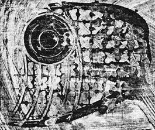
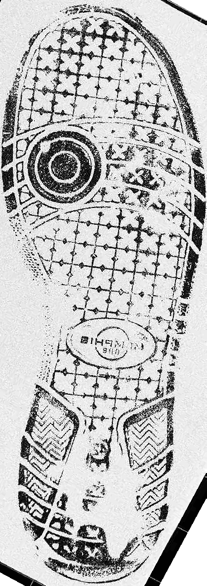

```{r setup, include=FALSE}
knitr::opts_chunk$set(echo = F, fig.show = "hold")
library(imager)
```

## Introduction

When a crime is committed, the evidence collected by crime scene investigators may come in different forms. The criminal may have left a droplet of blood from which a DNA profile can be extracted. Or s/he may have shed textile fibers that can be characterized by their physical and chemical attributes. Or, most commonly, the perpetrator of the crime left a shoe print, or a finger print, or some other form of what is known as pattern evidence. In the forensics community, pattern evidence includes hand-writing, firearms and tool marks, finger prints and shoe prints, tire tread prints, blood spatter, and anything else that comes in the form of an image.

Regardless of the type of evidence available to investigators, a question of interest typically involves the issue of source; could the suspect’s shoe have left the bloody print next to the victim? Did the saliva on the cigarette butt come from the suspect’s mouth? Notice that even if the answers to these questions is yes, this would not imply that the suspect is the perpetrator of the crime, since there may be innocent reasons that explain the suspect’s contact with the crime scene. But determining whether the suspect could have been the source of the evidence is an important first step in most forensic analysis.

If DNA can be extracted from the evidence, or when the evidence can be characterized using quantitative measurements, then we can often resort to standard statistical methods to compare two samples and test the hypothesis of same source. But when the evidence consists of a pattern, then the usual modeling framework is no longer an option. Figure 1 illustrates the problem. The left panel shows a latent print found at a crime scene and the right panel shows a reference print obtained from the suspect’s shoe. We wish to determine whether the shoe could have been the source of the latent print, and if possible, we would like to attach an estimate of uncertainty to the conclusion.

```{r latent-shoe-print, fig.cap = "Latent shoe print and reference outsole image of a suspect's shoe.", fig.subcap=c("Latent print", "Reference outsole print"), fig.asp = 1, fig.ncol = 2, out.width = ".45\\textwidth"}
load.image(c("figure/crime_scene_90.jpg", "figure/database_60.png"))


```

Comparing images such as those shown in Figure 1 is challenging for several reasons. First, we do not have, as in the case of DNA, a generative model that would enable us to reduce the dimensionality of the images and establish a formal testing approach. Second, a typical image has tens of thousands of pixels, and further, a pixel-by-pixel comparison is not robust to changes in scale, rotation, and translation. Finally, it is not obvious whether the information contained in the image can be summarized into a few measurements that could then be used to carry out the comparison.

As a consequence, the state of the art for evaluating and interpreting most types of pattern evidence is a subjective approach, where forensic examiners rely mostly on their training and experience. In a typical evaluation, the examiner will compare the two samples side by side, and will decide whether the number of common features in both images is large enough to conclude that the two samples could have a common source. Depending on the specific area, examiners may rely on instruments such as a comparison microscope, but the final decision is almost entirely subjective.

While some forensic examiners have years and even decades of experience, the fact that the evaluation of pattern evidence continues to be subjective is problematic. For most of the pattern disciplines, there is no universal agreement of what constitutes “similar enough”. All fingerprint examiners make use of a common set of specific minutiae when comparing two prints for example, but there is no rule that says that the number of minutiae in agreement must be at least $x$ before the prints are deemed to be similar. Another challenge that arises from the subjective evaluation of evidence is that it is also difficult to estimate the rate of errors, not only for individual examiners but for the discipline as a whole. Experience is no substitute for experimentation, where ground truth is known, and the fact that an examiner may have never been challenged in court does not mean that he or she has never made a mistake. Finally, when assessments are subjective, it is possible that two examiners looking at the same evidence will reach different conclusions, or even that the same examiner will make a different assessment when examining the same evidence on two different occasions.

Because of these and several other concerns, the National Research Council of the United States assembled a panel of experts who in 2009 published a report that was strongly critical of all forensic disciplines with the exception of DNA analysis of single-donor or simple mixture samples.1 The report singled out pattern evidence as particularly lacking in scientific validity and rife with subjectivity, and called for an immediate and sustained research effort to shore up pattern evidence by – among other recommendations – developing the scientific and statistical framework that underpin any scientific discipline.

In the decade since, machine learning methods have been developed to try to address this issue of subjectivity in the assessment of pattern evidence.

## Pattern Recognition and Machine Learning

Pattern recognition is a scientific discipline ``concerned with the automatic discovery of regularities in data through the use of computer algorithms and with the use of these regularities to take actions such as classifying the data into different categories". In statistics, algorithms for pattern recognition are sometimes referred to as learning algorithms and can be used for inference or for prediction.

Algorithms for pattern recognition can be grouped into two major classes, the class of supervised learning methods and the class of unsupervised learning methods. Supervised learning algorithms assume that we have available a large set of units with known labels, called a training set. In statistical parlance, we use the term response instead of label, and predictors or independent variables instead of features. From this training set, the algorithm “learns” how the features relate to the labels, or in other words, produces an estimate of the function  that describes the association between features  and label . The idea is that once the algorithm has been trained, meaning that an estimate  has been obtained, the algorithm can be used to predict the labels for previously unseen objects. 

A good algorithm strikes a balance between the competing objectives of optimizing its performance on the training data while at the same time, minimizing classification errors when presented with new units. This is known as the variance-bias tradeoff; more flexible models, that fit the training data very well, have high variance, because even a small change in the data might result in a large change in the fitted model. On the other hand, models that fit the training data less closely, may be more robust to changes in the observations, but tend to exhibit a larger bias. An example of a supervised learning method is discriminant analysis, introduced to statisticians by Fisher (1936). Often, when labels are discrete, the learning algorithm is known as a classifier because it is typically used to classify units into different classes. Neural nets (NN) and convolutional neural nets (CNN) are also examples of supervised learning algorithms (Goodfellow et al. 2016), although they are sometimes referred to as unsupervised methods.

Unsupervised learning algorithms, in contrast, do not depend on the availability of training data with known labels. Here, the assumption is that we observe a set of measurements or features  on a large sample of units, but not the corresponding response or label. Instead, the algorithm itself determines the combination of features that best represent a class and that maximize the probability of assigning the correct label to a new unit. Unsupervised learning algorithms find patterns in the training data and in this sense, are similar to data mining or knowledge data discovery (KDD), methods that are used more commonly in business applications. While this type of methods have been used in forensic applications (e.g. Kong et al. 2019), we focus on the use of learning algorithms to address questions of source.

## Firearm Identification

Firearm identification is one area of forensics in which learning algorithms have been used to address questions of source. As currently practiced, firearms examination is a combination of science and art. Current standard practice is for a firearms examiner to compare two bullet samples - one recovered from a crime scene, the other a test shot fired by a suspect’s gun – side by side under a comparison microscope. The examiner then subjectively determines whether the samples are distinguishable or indistinguishable, or if the comparison is inconclusive.

This determination is made based on comparisons of the marks left on a bullet (or its cartridge case) after it has been fired. Marks are made in a number of ways. One cause is the rifling of a gun barrel (the spiral groves that impart rotation to the bullet as it is expelled), which create a pattern of groove engraved areas and land engraved areas (lands being the areas between each groove). In the United States, where firearms are readily accessible, the annual number of gun-related crimes is in the hundreds of thousands, and about two thirds of all murders are committed with a gun (United States Bureau of Federal Investigations 2017). Therefore, most crime labs employ one or more experts in firearms identification, who can compare bullets or cartridge cases found in a crime scene with test shots obtained from the suspect’s gun, or with samples recovered from a different crime scene.

Firearms identification – or ballistics, as it is sometimes incorrectly called – has been practiced for a long time. Wilson and Wilson (2003) tell the story of Confederate General Jackson, who was killed in battle in 1863, during the Civil War. The slug recovered from his body was examined and found to be a 0.67-caliber ball, the type of ammunition used by Confederate, not by Union soldiers. This first application of forensic ballistics investigation led to the surprising conclusion that General Jackson had been killed by one of his own men. Today, forensic examiners will seek to ascertain the type of ammunition used in a crime, but they will also try to establish whether a bullet was fired by a specific gun. Figure ... shows the engraved areas left behind by the lands and grooves of the barrel on the bullet. Small imperfections in the surface of the barrel create striations on the bullet as it leaves the gun. Marks are also imprinted to the base of the cartridge case by the breech face of the gun at the time it is fired. The right panel in Figure \ref{fig:bullet-cartridge-images} shows a cartridge case with breech face marks. While the class or rifling characteristics of a gun can be readily determined from the pattern of land engraved areas and grooves on a bullet, or from the shape of the firing pin impression on the base of a cartridge case, it is the microscopic sub-class and individual striations that are used in firearms identification.

```{r bullet-cartridge-images, fig.cap = "Striations on fired bullets (left) and marks imprinted by the breech face and firing pin on the primer of a spent cartridge case (right)", out.width = ".49\\textwidth"}
knitr::include_graphics("figure/Bullet.png")
knitr::include_graphics("figure/Cartridge.png")
```

As currently practiced, firearms examination is a combination of science and art. But in the past 20 years or so there has been a push to use imaging technology to obtain actual measurements of the surface topology of land engraved areas on bullets and of cartridge case bases that might enable more objective analysis of the similarity between two samples. One of the first proponents of measuring features of the surface topology of bullets were De Kinder and Bonfanti.3 The authors used a laser profilometer to scan bullets and obtain measurements of the distance and depth of striations. They then computed a correlation between two aligned sets of features to quantify the similarity between two bullets. Since then, several new methods that rely on 2D and 3D imaging of bullets and cartridge cases have been proposed to quantify the similarity between two items. In 2017 Hare et al. proposed using supervised learning algorithms to construct a similarity score that can be used to compare bullets.4

For most rifling types, fired bullets exhibit a sequence of land engraved areas separated by grooves. The striations that are used to compare bullets appear on the land engraved areas, so the measurements are obtained by scanning each area individually. Measurements on a land engraved area consist of heights on an $x-y$ grid in micron-level increments. The exact resolution at which images are taken depends on the microscope. In Hare et al., scans made available through the NIST Ballistics Research Database were used. These scans are taken at a resolution of $1.5625 \mu m \times 1.5625\mu m$. The total area that is captured from each land engraved area is approximately $2.2 mm \times 0.6 mm$, and the data are the $x-y-z$  coordinates of each point on the grid. Figure 3 shows the 3D scan of a land engraved area of a bullet fired from a Smith & Wesson firearm. The most informative striations are located close to the bottom of the bullet, in the area shaded in red in the figure.

