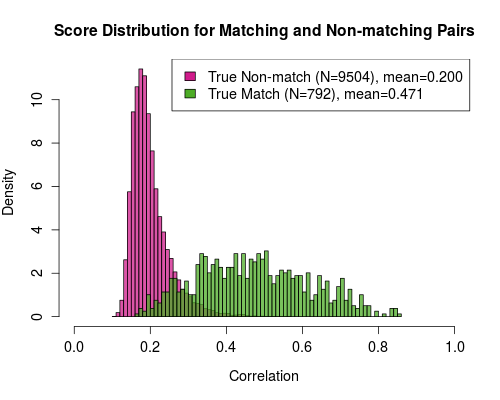

```{r setup, include=FALSE, echo = F}
knitr::opts_chunk$set(echo = F, message = F, warning = F, fig.align = "center", 
                      dev = "CairoPDF", cache = T)
library(imager)
library(x3ptools)
library(bulletxtrctr)
library(cowplot)
library(gridExtra)
library(tidyverse)
```

```{r features-setup}

features <- read.csv("data/H44-old-features.csv")

# f2 <- features %>%
#   tidyr::separate(land1, c("barrel1", "bullet1", "land1"), "-") %>%
#   tidyr::separate(land2, c("barrel2", "bullet2", "land2"), "-")

f2nest <- features %>% filter(!(barrel1==barrel2 & bullet1 == bullet2)) %>%
  group_by( bullet2, barrel1, barrel2, bullet1) %>%  nest()

rotate <- function(x, lag) {
  n <- length(x)
  rep(x, 2)[lag+1:n]
}

f3nest <- f2nest %>% mutate(
  sam_ccf = data %>% purrr::map_dbl(.f=function(d) {
    dt = xtabs(ccf ~land1+land2, data=d)
    drow <- dim(dt)[2]
    1:drow %>% purrr::map_dbl(.f=function(i) {
      mean(diag(dt[,rotate(1:drow,i)]))
    }) %>% max()
  }),
  sam_rf = data %>% purrr::map_dbl(.f=function(d) {
    dt = xtabs(rfscore ~land1+land2, data=d)
    drow <- dim(dt)[2]
    1:drow %>% purrr::map_dbl(.f=function(i) {
      mean(diag(dt[,rotate(1:drow,i)]))
    }) %>% max()
  }),
  sam_rf_phase = data %>% purrr::map_dbl(.f=function(d) {
    dt = xtabs(ccf ~land1+land2, data=d)
    drow <- dim(dt)[2]
    1:drow %>% purrr::map_dbl(.f=function(i) {
      mean(diag(dt[,rotate(1:drow,i)]))
    }) %>% which.max()
  }),
  KM_sam = sam_rf > 0.5
)

inphase <- function(land1, land2, sam_rf_phase, ...) {
  as.numeric(land2) %% 6 == (as.numeric(land1) + sam_rf_phase) %% 6
}

tmp <- unnest(f3nest) %>%
  mutate(inphase = purrr::pmap_lgl(., inphase),
         KM = inphase & KM_sam)
```
# Introduction

<!-- Probably need to replace at least some of this with a history/lit review... -->
<!-- When a crime is committed, the evidence collected by crime scene investigators may come in different forms. The criminal may have left a droplet of blood from which a DNA profile can be extracted. Or s/he may have shed textile fibers that can be characterized by their physical and chemical attributes. Or, most commonly, the perpetrator of the crime left a shoe print, or a finger print, or some other form of what is known as pattern evidence. In the forensics community, pattern evidence includes hand-writing, firearms and tool marks, finger prints and shoe prints, tire tread prints, blood spatter, and anything else that comes in the form of an image. -->

<!-- Regardless of the type of evidence available to investigators, a question of interest typically involves the issue of source; could the suspect’s shoe have left the bloody print next to the victim? Did the saliva on the cigarette butt come from the suspect’s mouth? Notice that even if the answers to these questions is yes, this would not imply that the suspect is the perpetrator of the crime, since there may be innocent reasons that explain the suspect’s contact with the crime scene. But determining whether the suspect could have been the source of the evidence is an important first step in most forensic analysis. -->

<!-- If DNA can be extracted from the evidence, or when the evidence can be characterized using quantitative measurements, then we can often resort to standard statistical methods to compare two samples and test the hypothesis of same source. But when the evidence consists of a pattern, then the usual modeling framework is no longer an option. \autoref{fig:latent-shoe-print} illustrates the problem. The left panel shows a latent print found at a crime scene and the right panel shows a reference print obtained from the suspect’s shoe. We wish to determine whether the shoe could have been the source of the latent print, and if possible, we would like to attach an estimate of uncertainty to the conclusion. -->

<!-- ```{r latent-shoe-print, fig.cap = "Latent shoe print and reference outsole image of a suspect's shoe.", out.width = "\\textwidth", echo = F, fig.width = 8, fig.height = 5} -->
<!-- lst <- lapply(c("figure/crime_scene_90.jpg", "figure/database_60.png"), load.image) -->
<!-- lst[[1]] <- lst[[1]] %>% imrotate(-90) %>% pad(. , 321, "y", pos = 1, val = rep(1, spectrum(.))) %>% pad(10, "x", val = rep(1, spectrum(.))) -->
<!-- imappend(lst, "x") %>% imrotate(-90) %>% plot(axes = F) -->
<!-- ``` -->

<!-- Comparing images such as those shown in \autoref{fig:latent-shoe-print} is challenging for several reasons. First, we do not have, as in the case of DNA, a generative model that would enable us to reduce the dimensionality of the images and establish a formal testing approach. Second, a typical image has tens of thousands of pixels, and further, a pixel-by-pixel comparison is not robust to changes in scale, rotation, and translation. Finally, it is not obvious whether the information contained in the image can be summarized into a few measurements that could then be used to carry out the comparison. -->

<!-- As a consequence, the state of the art for evaluating and interpreting most types of pattern evidence is a subjective approach, where forensic examiners rely mostly on their training and experience. In a typical evaluation, the examiner will compare the two samples side by side, and will decide whether the number of common features in both images is large enough to conclude that the two samples could have a common source. Depending on the specific area, examiners may rely on instruments such as a comparison microscope, but the final decision is almost entirely subjective. -->

<!-- While some forensic examiners have years and even decades of experience, the fact that the evaluation of pattern evidence continues to be subjective is problematic. For most of the pattern disciplines, there is no universal agreement of what constitutes “similar enough”. All fingerprint examiners make use of a common set of specific minutiae when comparing two prints for example, but there is no rule that says that the number of minutiae in agreement must be at least $x$ before the prints are deemed to be similar. Another challenge that arises from the subjective evaluation of evidence is that it is also difficult to estimate the rate of errors, not only for individual examiners but for the discipline as a whole. Experience is no substitute for experimentation, where ground truth is known, and the fact that an examiner may have never been challenged in court does not mean that he or she has never made a mistake. Finally, when assessments are subjective, it is possible that two examiners looking at the same evidence will reach different conclusions, or even that the same examiner will make a different assessment when examining the same evidence on two different occasions. -->

<!-- Because of these and several other concerns, the \citeauthor{StrengtheningForensicScience2009} assembled a panel of experts who in 2009 published a report that was strongly critical of all forensic disciplines with the exception of DNA analysis of single-donor or simple mixture samples. The report singled out pattern evidence as particularly lacking in scientific validity and rife with subjectivity, and called for an immediate and sustained research effort to shore up pattern evidence by – among other recommendations – developing the scientific and statistical framework that underpin any scientific discipline. -->

<!-- In the decade since, machine learning methods have been developed to try to address this issue of subjectivity in the assessment of pattern evidence. -->

<!-- ## Pattern Recognition and Machine Learning -->

<!-- Pattern recognition is a scientific discipline ``concerned with the automatic discovery of regularities in data through the use of computer algorithms and with the use of these regularities to take actions such as classifying the data into different categories". In statistics, algorithms for pattern recognition are sometimes referred to as learning algorithms and can be used for inference or for prediction. -->

<!-- Algorithms for pattern recognition can be grouped into two major classes, the class of supervised learning methods and the class of unsupervised learning methods. Supervised learning algorithms assume that we have available a large set of units with known labels, called a training set. In statistical parlance, we use the term response instead of label, and predictors or independent variables instead of features. From this training set, the algorithm “learns” how the features relate to the labels, or in other words, produces an estimate of the function  that describes the association between features  and label . The idea is that once the algorithm has been trained, meaning that an estimate  has been obtained, the algorithm can be used to predict the labels for previously unseen objects.  -->

<!-- A good algorithm strikes a balance between the competing objectives of optimizing its performance on the training data while at the same time, minimizing classification errors when presented with new units. This is known as the variance-bias tradeoff; more flexible models, that fit the training data very well, have high variance, because even a small change in the data might result in a large change in the fitted model. On the other hand, models that fit the training data less closely, may be more robust to changes in the observations, but tend to exhibit a larger bias. An example of a supervised learning method is discriminant analysis, introduced to statisticians by \citet{fisherUSEMULTIPLEMEASUREMENTS1936}. Often, when labels are discrete, the learning algorithm is known as a classifier because it is typically used to classify units into different classes. Neural nets (NN) and convolutional neural nets (CNN) are also examples of supervised learning algorithms \citep{Goodfellow2016}, although they are sometimes referred to as unsupervised methods. -->

<!-- Unsupervised learning algorithms, in contrast, do not depend on the availability of training data with known labels. Here, the assumption is that we observe a set of measurements or features  on a large sample of units, but not the corresponding response or label. Instead, the algorithm itself determines the combination of features that best represent a class and that maximize the probability of assigning the correct label to a new unit. Unsupervised learning algorithms find patterns in the training data and in this sense, are similar to data mining or knowledge data discovery (KDD), methods that are used more commonly in business applications. While this type of methods have been used in forensic applications \citep{kongCrossDomainImageMatching2019a}, we focus on the use of learning algorithms to address questions of source. -->

In the United States, where firearms are readily accessible, the annual number of gun-related crimes is in the hundreds of thousands, and about two thirds of all murders are committed with a gun \citep{fbi2017}. Almost 400 million guns of all types are owned by civilians, meaning that in the United States, there is about 1.2 guns for every man, woman and child.  Therefore, most crime labs employ one or more experts in firearms identification, who can visually compare bullets or cartridge cases found in a crime scene with test shots obtained from the suspect’s gun, or with samples recovered from a different crime scene.

Visual comparisons are challenging for several reasons. First, we do not have, as in the case of DNA, a generative model that would enable us to reduce the dimensionality of the images and establish a formal testing approach. Second, a typical image has tens of thousands of pixels, and further, a pixel-by-pixel comparison is not robust to changes in scale, rotation, and translation. Finally, it is not obvious whether the information contained in the image can be summarized into a few measurements that could then be used to carry out the comparison. 

As a consequence, the state of the art for evaluating and interpreting most types of pattern evidence including striations on bullets and cartridge cases is a subjective approach, where forensic examiners rely mostly on their training and experience. In a typical evaluation, the examiner will compare the two samples side by side, and will decide whether the number of common features in both images is large enough to conclude that the two samples could have a common source. Examiners may rely on instruments such as a comparison microscope and limited measurements of characteristics such as rifling pitch, or examine national databases such as NIBIN \citep{nibin}, but the final decision is almost entirely subjective.
The final decision is typically one of identification if the samples are sufficiently similar, exclusion if there are significant dissimilarities, or inconclusive if there are not sufficient features to make a determination. 

While some forensic examiners have years and even decades of experience, the fact that the evaluation of pattern evidence continues to be subjective is problematic. For most of the pattern disciplines, there is no universal agreement of what constitutes ``similar enough". All fingerprint examiners make use of a common set of specific minutiae when comparing two prints for example, but there is no rule that says that the number of minutiae in agreement must be at least $x$ before the prints are deemed to be similar. Another challenge that arises from the subjective evaluation of evidence is that it is also difficult to estimate the rate of errors, not only for individual examiners but for the discipline as a whole. Experience is no substitute for experimentation, where ground truth is known, and the fact that an examiner may have never been challenged in court does not mean that he or she has never made a mistake. Finally, when assessments are subjective, it is possible that two examiners looking at the same evidence will reach different conclusions, or even that the same examiner will make a different assessment when examining the same evidence on two different occasions.

Because of these and several other concerns, the \citeauthor{StrengtheningForensicScience2009} assembled a panel of experts who in 2009 published a report that was strongly critical of all forensic disciplines with the exception of DNA analysis of single-donor or simple mixture samples. The report singled out pattern evidence as particularly lacking in scientific validity and rife with subjectivity, and called for an immediate and sustained research effort to shore up pattern evidence by – among other recommendations – developing the scientific and statistical framework that underpin any scientific discipline. Of particular concern for firearms and toolmark analysis is that the process of individualization be ``precise and repeatable", in contrast to the current methodological guidelines.

In the last few decades, there have been some attempts to develop methods to quantify the similarity between two bullets or two cartridge cases.  An early attempt by \citeauthor{biasottiStatisticalStudyIndividual1959} consisted of counting the number of consecutively matching striae (CMS) on two bullets.  The idea here is that when two bullets are fired from the same barrel, the number of consecutively matching striations is expected to be high.  While this proposition is likely to be true, the method did not get widely applied in practice because the discriminating power of CMS is limited. Figure \autoref{fig:HambyCMS} below was drawn using one of the Hamby sets of bullets (\citeauthor{hamby2009}).  The set of 20 bullets were fired from 10 consecutively rifled barrels, and the provenance of each bullet (same or different barrel) is known.  We constructed all possible pairs of bullets, some of which came from the same barrel and some of which did not.  The values along the horizontal axis represent the number of CMS, which for this dataset varied from 0 to 25.  For each value of CMS, the two colors on each column represent the proportion of pairs of bullets that had a common (orange) or a different (grey) source. For example, when CMS is equal to 2, 100\% of pairs with 2 CMS had a different source.  When CMS is 10 or higher, 100\% of all pairs of bullets have a common source.  

```{r HambyCMS, fig.cap="Proportion of pairs of bullets with same (orange) or different (grey) source given observed number of CMS.", fig.width = 8, fig.height = 4, out.width = ".75\\textwidth"}
tmp %>%
  mutate(
    lys = overlap*signature_length*1000/.645,
    CMS = round(cms2 *lys*.645/1000)
  ) %>%
  mutate(km_lab = c("Non-Match (KNM)", "Match (KM)")[KM + 1]) %>%
  filter(!(!KM & CMS > 10)) %>% # Exclude bad hamby bullets that show as nonmatches
ggplot(data = .) + 
  geom_bar(aes(x = CMS, fill = km_lab), position = "fill", color = "black") +
  scale_y_continuous("Proportion") + 
  scale_x_continuous("Consecutive Matching Striae (CMS)") +
  scale_fill_manual("", values = c("Non-Match (KNM)" = "darkgrey", "Match (KM)" = "darkorange")) + 
  theme(legend.position = "top", legend.justification = 'center')
```

From the figure, it seems that -- at least for this particular dataset -- when the observed number of CMS is between 4 and 10, a binary decision of same/different source has a non-negligible probability of being incorrect.

In recent years, there has been a push to develop more robust methods to address the question of source.  Much of the effort has been devoted to cartridge cases:  breech face impressions, firing pin impressions, firing pin aperture.  We describe some of these approaches in Section XXXXX.  Less attention has been devoted to bullets, perhaps due to the fact that bullets sometimes get damaged on impact and this makes the comparison more difficult. In both cases, methods based on machine learning and computer vision have gained in popularity among researchers and appear to be promising for use in case work. 

Machine learning can be used to augment the subjective perceptions of examiners, providing a quantitative foundation for the assessment of questions of source in firearms identification. In order to leverage machine learning techniques for firearm identification, researchers mostly use supervised learning algorithms and large amounts of labeled training data, called a training set, to assess how features from the data relate to the labels. From the training set, the algorithm ``learns" how the features relate to the labels, or in other words, produces an estimate of the function that describes the association between features and label. Once the algorithm has been trained, it can be used to examine new data outside the original training set. 

A good algorithm strikes a balance between the competing objectives of optimizing its performance on the training data while at the same time, minimizing classification errors when presented with new units. This is known as the variance-bias tradeoff; more flexible models, that fit the training data very well, have high variance, because even a small change in the data might result in a large change in the fitted model. On the other hand, models that fit the training data less closely, may be more robust to changes in the observations, but tend to exhibit a larger bias. Often, when labels are discrete, the learning algorithm is known as a classifier because it is typically used to classify units into different classes. 

This chapter is organized as follows.  We first provide a brief description of firearms and ammunition and introduce some of the language used in firearm examination.  We then briefly revisit the history of the discipline of firearms examination. In Section XXXX we present the state of the practice, and finally describe the new methodology for bullet and cartridge case comparisons and where the science is likely to go next.  We finish with a partial list of knowledge gaps and opportunities for research.  

# The anatomy of guns and of ammunition

About 12.5 million guns were manufactured in the United States in 2016, of which approximately 50\% were pistols or revolvers.  In the same year, the United States imported slightly over five million firearms, the vast majority of which were handheld pistols and revolvers. Here we briefly describe the components and operation of pistols and revolvers, since according to the FBI \citep{fbi2017} over 70\% of all gun-related crimes involve one of those types of firearms.

The main difference between a revolver and a pistol is the mechanism to load ammunition into the \emph{chamber}.  In a revolver, cartridges are loaded into their own chamber in a cylinder that rotates with each pull of the trigger (in \emph{single-action} revolvers) or continuously, with a continued pull of the trigger (\emph{double-action}).  The capacity of the cylinders tends to be limited to six cartridges, and cartridges are not ejected from the cylinder each time the revolver is fired.  In a pistol, cartridges are loaded into a \emph{magazine} that can contain anywhere between 5 and 18 rounds, depending on caliber and type of magazine.  Pistols are self-loading firearms because a fresh cartridge from the magazine is automatically moved into the single chamber when the \emph{slider} of the gun is pulled backwards. The spring-loaded slider then goes back forward, feeding the first cartridge into the barrel for firing.  The pistol is fired with each new pull of the trigger, and the next cartridge in the magazine is moved into the barrel.  This is why this type of firearm is known as a \emph{semi-automatic} weapon.  In contrast to what happens when a revolver is fired, cartridge cases are ejected from the barrel of a pistol at the time of firing \citep{heard1997}. \autoref{fig:cutaway} shows a Luger 1901 pistol cutaway with important parts labeled.

\begin{figure}
\centering
\includegraphics[width=.8\textwidth]{figure/Luger-Cutaway.png}
\caption{A 1901 Luger pistol. Image modified from Rock Island Auction Co. [CC0], via Wikimedia Commons (\url{https://commons.wikimedia.org/wiki/File:Luger_cutaway.jpg})}
\end{figure}

```{r pistol, eval = F, fig.cap = "Simple diagram of a semi-automatic pistol. \\footnotesize{Image modified from \\href{https://XXXXXXXXXXX}.", out.width = ".5\\textwidth"}
knitr::include_graphics("figure/semi-automatic-gun.png")
```
When the firearm is fired, several things occur.  First, the firing pin hits the primer at the base of the cartridge, causing a small explosion that ignites the propellant.  As it burns, the propellant creates  gas inside the cartridge case.  The tremendous change in pressure inside the cartridge case separates the bullet from the cartridge and pushes it down the barrel at a speed of about 300 m/s.  Most barrels are \emph{rifled}, meaning that their interior has grooves and lands (typically six of each) at an angle, and this imparts rotation to the bullet as it travels down the barrel.  This improves stability in the flight of the bullet.  Consequently, fired bullets also show a pattern of land impressions and grooves that correspond to the rifling of the barrel.  In addition to separating the bullet from the cartridge, the explosion caused by the accumulation of gases in the cartridge case makes the base of the cartridge case slam against the breech face of the pistol. Cartridge cases in semi-automatic pistols are typically ejected once the bullet is separated. Figure XXXXX shows a cartridge, the base of the fired cartridge, and a bullet with land engraved areas and grooves.

ADD FIGURE HERE.


# A Brief History of Firearms Identification

<!-- Not the first - 1835 Bow Street Runners case in London (homemade ammunition matched to a mold) -->
Firearms identification – or ballistics, as it is sometimes incorrectly called – has been practiced for a long time.  Its first recorded use around 1835 is attributed to the Bow Street Runners, the first police-like force in London, precursor of the Metropolitan police (REFERENCE). \citet{wilson2003written} tell the story of Confederate General Jackson, who was killed in battle in 1863, during the Civil War. The slug recovered from his body was examined and found to be a 0.67-caliber ball, the type of ammunition used by Confederate, not by Union soldiers, leading to the surprising conclusion that General Jackson had been killed by one of his own men. 

In \citeyear{hallMissileWeapon1900}, a paper by \citeauthor{hallMissileWeapon1900} published in the Buffalo Medical Journal detailed methods for test firing weapons (into a bag of meal) for the purposes of comparing the engravings resulting from the rifling. While it is not clear from the paper whether the comparisons made are class characteristics (e.g. the spacing of land and groove engraved areas) or individual characteristics, this represents the first known foray into what might be termed ``modern" examinations of fired bullets. In 1902, testimony concerning the markings on bullets was admitted into evidence \citep{commonwealthVbest} in a criminal case for the first time, and in 1907, fired cartridge cases were also used as evidence \citep{brownsvilleRiot}. In 1912, photographic comparisons were used to examine individualized markings of land and groove engraved areas; enlarged photographs were also used to compare cartridge case marks. In the 1920s, the idea that individualizing characteristics are present on fired bullets and cartridges became more widely accepted across the country, accompanied by an increase in court cases involving evidence from bullets and cartridge cases. A thorough historical review of the discipline of firearms identification can be found in \citep{hamby-thorpe-1999}.


The process of comparing the striations of bullets recovered from a crime scene to test-fired bullets from recovered weapons became much easier in 1925 with the invention of the comparison microscope, which allowed two bullets to be examined simultaneously and manually aligned\citep{afte-examiner-training}. \autoref{fig:comparison-scope} shows a comparison microscope; portions of both bullets under examination are shown in a single unified view window. The same year, a series of two articles in the Saturday Evening Post described the potential uses of firearms identification in popular press \citep{BulletsExpertWitness,BulletsSilentWitness}, increasing the public's awareness of the potential of firearm forensics. Five years later, Goddard would testify about the firearms used in the Valentine's Day Massacre \citep{goddardValentineDayMassacre1930}; this testimony included analysis of the cartridge cases recovered from the scene as well as the markings left on the bullets. 

```{r comparison-scope, fig.cap = "A comparison microscope, which consists of two identical microscopes connected to a single eyepiece. The viewer sees the images of both bullet surfaces simultaneously, facilitating alignment and comparison of the bullet striae, shown in the inset image. \\footnotesize{Image modified from \\href{https://commons.wikimedia.org/wiki/File:ComparisonMicroscope.png}{Tamasflex [CC BY-SA 3.0], via Wikimedia Commons}}.", out.width = ".5\\textwidth"}
knitr::include_graphics("figure/ComparisonMicroscope.png")
```

Firearms investigation became more formalized in the 1930s, with textbooks published on the subject in both the UK and the United States \citep{burrard1934identification,hatcherTextbookFirearmsInvestigation1935,gunther1935identification}. The 1930s also saw the foundation of a number of laboratories focused on the scientific examination of forensic evidence, a trend that continued into the 1940s. In the 1950s and 1960s, the field began to move toward greater quantification of firearms evidence, with the introduction of the striagraph \citep{davis1968introduction}, an early forerunner of laser and digital scanning of bullets. In \citeyear{biasottiStatisticalStudyIndividual1959}, \citeauthor{biasottiStatisticalStudyIndividual1959} published a landmark paper discussing the use of visual features of pairwise bullet comparisons to produce a quantitative description of the strength of the match between the two bullets. Biasotti examined the striation marks on fired bullets under a virtual comparison microscope and determined that consecutive matching striations could be used to determine the strength of a match between two bullets which were aligned based of visual assessment of striation patterns. Based on a sample of bullets fired from 24 Smith \& Wesson revolvers, Biasotti determined that bullets fired from different guns were extremely unlikely to have more than 6 consecutively matching striae. This quantitative threshold for determining whether two pieces of evidence originate from the same firearm was the first attempt to derive an empirical threshold for the strength of a match in firearms examination. 

Some methods have been developed to automatically match high-resolution photographs of bullet land engraved areas or cartridge cases \citep{gardnerComputerIdentificationBullets1978,geradtsImageMatchingAlgorithms2001}, but in the past 20 years or so there has been a push to use 3D imaging technology to obtain actual measurements of the surface topology of land engraved areas on bullets and of cartridge case bases. Methods which depend on photographs rely on inferring the height of the surface from the color of the image pixels; topological measurements provide much greater precision in assessing the similarity of two samples. One of the first proponents of measuring features of the surface topology of bullets were \citet{dekinderAutomatedComparisonsBullet1999}. The authors used a laser profilometer to scan bullets and obtain measurements of the distance and depth of striations. They then computed a correlation between two aligned sets of features to quantify the similarity between two bullets. Since then, several new methods that rely on 2D and 3D imaging of bullets and cartridge cases have been proposed to quantify the similarity between two items\citep{tongFiredCartridgeCase2014,fischerDigitalCrimeScene2014,chumbleyValidationToolMark2010}. In 2017, \citeauthor{hare2017algorithmic} demonstrated the use of supervised learning algorithms to construct a similarity score that can be used to assess the strength of a match between two bullets quantitatively, and \citet{taiFullyAutomaticMethod2018} constructed a similar scoring algorithm for cartridge case comparison.

# Microscopic Imperfections

Forensic examiners will begin an examination of crime scene evidence by identifying class characteristics, such as ammunition type, rifle pitch, number of grooves, and other features shared by many different guns and bullets; the second stage of the process is to establish whether a bullet was fired by a specific gun using individualizing characteristics. Most automatic algorithms bypass the comparison of class characteristics and only examine the microscopic sub-class and individual striations that uniquely identify a specific barrel. The left panel of \autoref{fig:bullet-cartridge-images} shows the engraved areas left behind by the lands and grooves of the barrel on the bullet. Small imperfections in the surface of the barrel create striations on the bullet as it leaves the gun. Marks are also imprinted to the base of the cartridge case by the breech face of the gun at the time it is fired; these marks can also be compared through a similar process. The right panel in Figure \ref{fig:bullet-cartridge-images} shows a cartridge case with breech face marks.

```{r bullet-cartridge-images, fig.cap = "Striations on fired bullets (left) and marks imprinted by the breech face and firing pin on the primer of a spent cartridge case (right)", out.width = "\\textwidth"}
lst <- c("figure/Bullet.png", "figure/Cartridge.png") %>%
  lapply(., load.image)

lst[[2]] <- imresize(lst[[2]], scale = pmin(height(lst[[1]])/height(lst[[2]]), width(lst[[1]])/width(lst[[2]]))) %>% 
  pad(10, axes = "x", pos = 1, val = rep(1, spectrum(.)))
imappend(lst, "x") %>% plot(axes = F)
```
# Comparison of cartridge case marks

With the advent of high resolution 2D and 3D microscopy, researchers in the last two decades have proposed several new methods to quantify the similarity between two bullets or cartridge cases.  Much of the research has focused on cartridge cases rather than bullets, probably because bullets tend to get damaged on impact and are recovered with lower frequency (NRC, 2008). A partial list of the research results presented in the last two decades includes \citeauthor{bachrach2002}, \citeauthor{vorburger2011}, \citeauthor{weller2012}, \citeauthor{song2013}, \citeauthor{chu2013}, \citeauthor{riva-champod-2014}, \citeauthor{zheng2014}, \citeauthor{vorburger2015}, \citeauthor{song2018}. 

\citeauthor{song2018} review a method called Congruent Matching Cells (CMC) to compare the breech face impressions on two cartridge cases.  The data with which the authors work are 3D images of breech face markings on the base of cartridge cases, obtained via confocal microscopy. The comparison method consists in first dividing the reference sample into a grid of cells and then implementing an automated search for the closest matching areas on the questioned sample.  \autoref{fig:CMC} illustrates the method.

```{r CMC, fig.cap = "The Congruent Matching Cells method. Known sample is shown in the left panel and questioned sample is shown on the right panel. \\footnotesize{Image copied from \\citeauthor{song2018}\\href{https://doi.org/10.1016/j.forsciint.2017.12.013}", out.width = ".5\\textwidth"}
knitr::include_graphics("figure/CMCFig2Song2018.pdf")
```


The number of CMC can be thought of as a \emph{score};  when two cartridge cases are fired from the same gun, we expect to see a larger number of CMC than when the rounds were fired from different guns.  To establish a threshold number of CMC to conclude that the samples were indeed fired from the same gun, the authors obtain the empirical distribution of the number of CMC among pairs of cases known to have been fired by the same gun and pairs of cases known to have been fired by different guns.  Their method is promising in that the empirical distributions, at least for the cases they have considered, put mass on distinctly different ranges of number of CMC for known matching and known non-matching pairs of cases.

Instead of dividing the image into cells, a common alternative is to use a global measure of similarity between two images, for example the correlation between the corresponding pixels in the two images. In order for such methods to work, a series of processing and alignment steps is required. These  methods are described by \citeauthor{Tai-Eddy-2018} for the case of 2D cartridge case images.

The first step in the pre-processing of the image is to select parts of the image that are of interest, in this case the breechface marks. This involves removing the firing pin impression, and any other extraneous details outside of the perimeter of the breechface marks. This can be done automatically either using image processing techniques, or in 3D by fitting a plane to the breechface area and setting a distance threshold beyond which information is discarded. Next, the image is further processed to highlight distinguishing features and remove sources of inaccuracies. For example, a Gaussian filter is commonly applied, which roughly corresponds to highlighting individual characteristics that examiners look for, while removing noise from the image acquisition process.

After pre-processing, a pair of images needs to be aligned to each other before a similarity score can be extracted. Assuming that images have been captured in a roughly similar manner, as is usually the case with equipment used in forensic laboratories, three parameters need to be estimated: the rotation angle, horizontal translation and vertical translation. This can be done using a grid search, looking for the set of parameters that maximizes the similarity measure. Other optimization techniques, such as the Lucas-Kanade algorithm \citep{Lucas-Kanade-1981}, often used in object tracking in the computer vision literature, have also been tested. These have the advantage of much shorter run-times compared to a grid search, but often get stuck in local minima, thus producing poorer overall results.

\citeauthor{Tai-Eddy-2018} test the above methods on various publicly available data sets maintained by NIST (https://tsapps.nist.gov/NRBTD/), and illustrate some of the results. Each data set contains a varying number of breech face images, collected for different purposes by groups in the firearms and toolmarks community. For example, a set called the NIST Ballistics Identification Database Evaluation (NBIDE) has images from 144 cartridge cases generated from three gun types (Sig Sauer, Ruger, and Smith \& Wesson), four guns of each type, four ammunition types (Remington, Winchester, PMC, and Speer), and firing three repetitions for each ammunition type. Both 2D images (using reflectance microscopy) and 3D topographies (using confocal microscopy) were captured. Given these 144 cartridge cases, there are a total of 10,296 pairs of cartridge cases, meaning that the procedure for pairwise alignment needs to be done 10,296 times. Since these data were collected as part of an experiment, the ground truth for whether each pair of images comes from the same gun is known, and \citeauthor{Tai-Eddy-2018} can generate plots of the empirical distribution of similarity scores for matching and non-matching pairs. These empirical distributions are shown in Figure \autoref{fig:NBIDEscores}. As we can see, non-matching pairs generally have low similarity scores, while matching pairs have either low or high scores.


```{r NBIDEscores, fig.cap = "Distribution of similarity scores for matching and non-matching pairs for the NBIDE data set. \\footnotesize{Image provided by  X-H Tai.}", out.width = ".5\\textwidth"}

```


If the problem of interest is to predict whether a specific pair of cartridge cases have the same source, we need to select a cutoff for the similarity score, above which we classify the pair to be a match. If distributions of similarity scores for matching and non-matching pairs were clearly separated for all data sets, such a cutoff would be straightforward to determine, but as we see in Figure \autoref{fig:NBIDEscores}, this is not the case. \citeauthor{Tai-Eddy-2018} consider different cutoffs, and illustrate the results using precision and recall graphs in Figure \autoref{fig:NBIDEprecRec}.

```{r NBIDEprecRec, fig.cap = "Precision and recall for various cutoffs on the similarity score. Additionally, precision and recall are also calculated for different cutoffs using different linkage methods in hierarchical clustering.. \\footnotesize{Image provided by  X-H Tai.}", out.width = ".5\\textwidth"}

```

In actual cases, forensic practitioners may have multiple cartridge cases to compare, so the issue of 
the transitivity of matches becomes important. Given that we are considering pairs of images, a classification method might produce the result that A matches B and B matches C, while A does not match C. In order to resolve this problem, \citeauthor{Tai-Eddy-2018} propose using hierarchical clustering on the pairwise results, with various types of linkages (see \citeauthor{murtagh}. In the example above, using single linkage would simply add a link between A and C, concluding that A, B and C all come from the same gun. Results observed after applying various clustering techniques to the similarity scores obtained by \citeauthor{Tai-Eddy-2018} are also plotted in Figure \autoref{fig:NBIDEprecRec}; average and minimax linkage produce the best results in terms of precision and recall on the NBIDE data set.

We conclude this section with several comments as well as suggestions for future research directions. In an actual implementation of the type of methodology described above, one might select cutoffs depending on the type of performance desired. For example, in a criminal case where the defendant might be implicated and prosecuted, false positives could be more undesirable than false negatives, in which case we might like a very high level of confidence in a conclusion of same source. If such a method is simply used to generate investigative leads, we might instead prefer high recall. Also, regardless of the type of algorithm used for comparing two breech face marks, different data sets produce varying quality of results (see, e.g., Figures \autoref{fig:NBIDEscores} and \autoref{fig:NBIDEprecRec}). This is roughly consistent with observations by examiners that some gun brands or ammunition types produce varying quality of marks. Finally, in light of the criticism of subjectivity in pattern matching techniques, any algorithm that is fully automatic and produces reliable and reproducible results would be highly desirable. Before any one approach is selected for application in real case work, it will be critical to continue testing and fine-tuning the different approaches that have been proposed, and that look promising.


# Comparison of marks on land engraved areas of bullets

For most rifling types, fired bullets exhibit a sequence of land engraved areas separated by grooves. The striations that are used to compare bullets appear on the land engraved areas, so the measurements are obtained by scanning each area individually. Measurements on a land engraved area consist of heights on an $x-y$ grid in micron-level increments. The exact resolution at which images are taken depends on the microscope. In \citeauthor{hare2017algorithmic}, scans made available through the NIST Ballistics Research Database were used. These scans are taken at a resolution of $1.5625 \mu m \times 1.5625\mu m$. The total area that is captured from each land engraved area is approximately $2.2 mm \times 0.6 mm$, and the data are the $x-y-z$  coordinates of each point on the grid. Figure 3 shows the 3D scan of a land engraved area of a bullet fired from a Smith & Wesson firearm. The most informative striations are located close to the bottom of the bullet, in the area shaded in red in the figure.

```{r generate-bullet-renders}
x3pfile <- read_x3p(file = "data/HS36-B1-B1-L1.x3p")
x3pfileb2 <- read_x3p(file = "data/HS36-B1-B2-L4.x3p")

# Interpolate a bit using imager - fill in holes in places where they're small
x3pfile2 <- x3pfile
x3pfile2$surface.matrix %<>% as.cimg() %>% inpaint(5) %>% as.matrix()
na_mask <- x3pfile$surface.matrix %>% is.na() %>% as.cimg() %>% clean(20)
na_mask2 <- na_mask %>% grow(30) %>% shrink(27)
x3pfile2$surface.matrix[na_mask2] <- NA

x3pfile2b2 <- x3pfileb2
x3pfile2b2$surface.matrix %<>% as.cimg() %>% inpaint(5) %>% as.matrix()
na_maskb2 <- x3pfileb2$surface.matrix %>% is.na() %>% as.cimg() %>% clean(20)
na_mask2b2 <- na_maskb2 %>% grow(30) %>% shrink(27)
x3pfile2b2$surface.matrix[na_mask2b2] <- NA

# image_x3p(x3pfilter, file = "figure/HS36-B1-nocrosscut.png", size = c(3577, 1023))
# image_x3p(x3pfile2b2, file = "figure/HS36-B2-nocrosscut.png", size = c(3607, 1023))

crosscut <- x3p_crosscut(x3pfile2)
nomask <- x3p_add_mask(x3pfile2, matrix("#cd7f32", ncol = 3577, nrow = 1023))
hline <- x3p_add_hline(nomask, yintercept = unique(crosscut$y - 100), color = "darkred", size = 40)
# image_x3p(hline)
# x3p_snapshot(file = "figure/HS36-Bullet-With-Crosscut.png")


x3pdf <- x3p_to_df(x3pfile)
x3pdf_filter <- filter(x3pdf, y > 150)
x3pfilter <- df_to_x3p(x3pdf_filter)

grooves <- list(groove = c(110, 2120))
signature <- cc_get_signature(crosscut, grooves)

# image_x3p(x3pfilter, multiply = 3)
# 
# pmat <- structure(c(0.9976, -0.00916, 0.06750, 
# 0, 0.0681, 0.1071, -0.9919, 
# 0, 0.00185, 0.99420, 0.1075, 0, 
# 0, 0, 0, 1), .Dim = c(4L, 4L))
# rgl::par3d(userMatrix = pmat)
# x3p_snapshot(file = "figure/HS36-Bullet-With-Crosscut_rotate90.png")

```

```{r bullet-scan-crosscut-image, fig.cap = "Scanned surface of a bullet land engraved area. Striations in the area shaded in red are most informative.", out.width = ".8\\textwidth"}

```

The algorithm proposed in \citeauthor{hare2017algorithmic} focuses on the average height of striations observed on a set of consecutive cross-sections of the land engraved area at a value of $y$ where striations appear to be stable; \autoref{fig:bullet-scan-crosscut-image} shows the selected value of $y$ for a land engraved area scan. \autoref{fig:bullet-scan-crosscut-side-view} shows the same scanned area as in \autoref{fig:bullet-scan-crosscut-image}, but viewed as a cross-section where $y$ is fixed. The bottom panel is a single-pixel representation of the cross-section shown in the upper panel. In both panels, it is evident where the land engraved area begins and ends, but in some cases, finding the grooves in an automated way is challenging.

One other attribute that is immediately noticeable from the figure is that the dominant structure in the cross-sectional representation of the land engraved area is the curvature of the surface of the bullet. Therefore, the first step toward extracting a signature from a bullet is to subtract the curvature from the image via a Loess fit. (Loess stands for “locally estimated scatterplot smoothing”, and is an approach to fit a smooth curve to a set of points by fitting a set of simple models to local subsets of the data.) The residuals from the Loess function represent the actual striations and are used to construct a signature. \autoref{fig:bullet-remove-curvature} shows the fitted curve in blue in the top panel, and the Loess residuals in the bottom panel. Note that the range of the residuals is approximately 6 $\mu$m. For some combinations of ammunition and gun, the striations are less pronounced.

```{r bullet-scan-crosscut-side-view, fig.cap =  "Sideways view of the scan from Figure 3 (top), with height measurements across the red shaded area (bottom).", out.width = ".8\\textwidth"}
plot_grid(
  ggdraw() + draw_image("figure/HS36-Bullet-With-Crosscut_rotate90.png"), 
  ggplot(aes(x = x, y = value), data = filter(x3pdf, abs(y - 329.595) < 10)) +
    geom_point(size = 0.5) +
    theme_bw() +
    coord_fixed(ratio = 3) +
    xlab("x") +
    ylab("z"),
  nrow = 2
)
```

```{r bullet-remove-curvature, fig.cap = "Loess fit to remove curvature shown in blue (top). Residuals from the Loess fit (bottom) show the relative heights of the engraved striae.", out.width = ".8\\textwidth", fig.width = 8, fig.height = 4}
p1 <- ggplot(aes(x = x, y = value), data = filter(x3pdf, abs(y - 329.595) < 2)) +
  geom_point(size = 0.5) +
  geom_smooth(aes(x = x, y = value), data = filter(x3pdf, abs(y - 329.595) < 10, x > 110, x < 2120)) +
  theme_bw() +
  xlim(c(0, 2300)) +
  xlab("Relative Location (in \u03BCm)") +
  ylab("Scan Height (in \u03BCm)") +
  theme(axis.title.x = element_blank(), axis.text.x = element_blank(), 
        axis.text.y = element_text(angle = 90), 
        plot.margin = margin(b = 0, unit = "pt"))

p2 <- ggplot(aes(x = x, y = sig), data = signature) +
  geom_line(size = 0.5) +
  theme_bw() +
  xlim(c(0, 2300)) +
  xlab("Relative Location (in \u03BCm)") +
  ylab("Signature (in \u03BCm)") +
  theme(plot.margin = margin(b = 0, unit = "pt"), 
        axis.text.y = element_text(angle = 90))

grid.arrange(p1, p2, nrow = 2, heights = c(1, 1.2))
```

## Pairwise Comparisons

Once the signatures from two bullets have been extracted, it is possible to compare the overlapped signatures using quantitative methods. For example, it is possible to compute a cross-correlation between two signatures, or to measure differences in the height of peaks or depth of valleys. Indeed, there are several different features that can be quantified and used to decide whether the signatures are similar enough to suggest that the bullets may have been fired from the same gun. \autoref{fig:overlaid-signatures} shows the overlain signatures for two bullets that were fired from the same gun. Even though the signatures are not exactly the same, the similarities are enough to suggest that they may have a common source.

```{r overlaid-signatures, fig.cap = "Overlaid signatures of two bullets fired from the same gun.", out.width = ".8\\textwidth"}
crosscut2 <- x3p_crosscut(x3pfileb2)
grooves2 <- list(groove = c(175, 2100))
signature2 <- cc_get_signature(crosscut2, grooves2)


align <- sig_align(signature$sig, signature2$sig)
aligndf <- align$lands %>%
  gather(key = type, value = sig, -x)

ggplot(aes(x = x, y = sig, linetype = type), data = aligndf) +
  geom_line(size = 0.5) +
  theme_bw() +
  xlim(c(0, 2300)) +
  xlab("Relative Location (in μm)") +
  ylab("Signatures (in μm)") +
  theme(plot.margin = margin(b = 0, unit = "pt")) +
  scale_linetype_discrete(guide = F)
```

\citet{hare2017algorithmic} considered various features; to decide whether any of them would serve to accurately determine whether two bullets could have been fired from the same gun, they carried out the following experiment. First, they sourced 3D images of bullets that were fired by Hamby et al. using 10 consecutively rifled 9mm Ruger barrels.  Next they constructed all possible pairs of images of land engraved areas; some pairs corresponded to the same land on bullets fired from the same barrel, others corresponded to either different pairs of land engraved areas on bullets fired from the same barrels or to pairs of land engraved areas on bullets fired from different barrels. Then, for each pair of images \citeauthor{hare2017algorithmic} computed the value of each of seven features; the distribution of values of each of the features among pairs of known matching land engraved areas and among pairs of known non-matching land engraved areas are shown in \autoref{fig:empirical-feature-dist}.


```{r empirical-feature-dist, fig.cap = "Empirical feature distributions", fig.width = 8, fig.height = 4, out.width = ".8\\textwidth"}
tmp %>% 
  select(KM, cms, non_cms, matches, mismatches, D, ccf, H.H) %>%
  set_names(c("Matches", "CMS", "CNMS", "# Matches", "# Non-Matches", "D", "CCF", "H.H")) %>%
  mutate(Matches = ifelse(Matches, "Match (KM)", "Non-Match (KNM)")) %>%
  group_by(Matches) %>%
  sample_n(486) %>%
  ungroup() %>%
  gather(key = "key", value = "value", -Matches) %>%
  ggplot(aes(x = value, fill = Matches)) + 
  theme_bw() + 
  geom_density(color = "black", alpha = .75, adjust = 2) + 
  scale_fill_manual(values = c("Non-Match (KNM)" = "darkgrey", "Match (KM)" = "darkorange")) +
  facet_wrap(~key, scales = "free", ncol = 4) + 
  ylab("Density") + 
  theme(legend.position = c(1, 0), legend.justification = c(1, 0), axis.title.x = element_blank())
```
Ideally, we would like to find one or more feature that can be used to discriminate between known matching and known non-matching pairs, but it appears from  \autoref{fig:empirical-feature-dist} that none of the seven features meets the criterion. This is because in every case there is significant overlap between the distributions of values among the two sets of images. \citet{hare2017algorithmic} proposed instead that features be combined into a single score using a random forest – an ensemble learning method for classification or regression based on the idea of decision trees \citep{breimanRandomForests2001}. For classification, the random forest outputs the most likely class for each unit, and each unit is scored between 0 and 1, where larger scores denote a higher degree of similarity. In fact, random forest scores can be thought of as the empirical probability of same class computed for each pair of images.

For the case of the Hamby bullets, the random forest produced a perfect classification of all pairs into the two classes. The separation between the values of the scores among known matching and known non-matching pairs was complete, as is shown in \autoref{fig:score-dist}.
```{r score-dist, fig.cap = "Random forest scores for the Hamby et al. (2009) known matching pairs of land engraved areas (dark blue) and known non-matching pairs (light blue).", fig.width = 8, fig.height = 4, out.width = ".8\\textwidth"}
f3nest %>% select(KM = KM_sam, sam_rf) %>%
  mutate(method = "Forest") %>%
  mutate(KM2 = c("KNM", "KM")[KM + 1] %>% as.factor()) %>%
  ggplot(aes(x = sam_rf, y = KM2, color = KM2, shape = KM2)) +
  facet_grid(method~.) +
  geom_jitter() +
  scale_color_manual(guide = F, values = c("KNM" = "darkgrey", "KM" = "darkorange")) +
  scale_shape_discrete(guide = F) +
  theme_bw() +
  theme(axis.title.y = element_blank()) +
  scale_x_continuous("Scores", limits = c(0, 1))
```

One limitation of learning algorithms is that they tend to over-fit the training data; as a consequence, an algorithm’s performance when classifying a new set of units can be dramatically worse and result in large mis-classification errors. To guard against over-fitting, it is possible to set aside a portion of the training data that can then be used as a test dataset, but even then, the mis-classification error tends to be under-estimated.

To explore whether the random forest fitted to the \citeauthor{hamby2009} bullets has good classification performance when used to classify pairs of land engraved areas from bullets fired by guns of different make and model, and when the ammunition is also made by a different manufacturer, we applied the model to thousands of pairs of known matching and known non-matching land engraved areas obtained from crime laboratories across the United States. Results have been promising; the random forest correctly determined every pair of bullets in every study when the gun barrel had conventional (rather than polygonal) rifling and striations were reasonably well marked, and when bullets were not coated with a polymer that flakes on contact with the barrel. 

We have found that some guns including Sig Sauer and Berettas impart shallow engravings, and we are currently revising the algorithm so that it will adapt to differences in depth of striations.  \autoref{fig:score-match-plot} shows the results observed in one such test set. Each pairwise comparison is represented as a square, with the center of the square shaded to represent the composite match score for the six lands on each bullet; the border of the square is colored orange if the bullets are from the same source. In the test set shown in \autoref{fig:score-match-plot}, there are three reference shots from each of eight barrels, and 10 fired rounds of unknown provenance. The test set was open, which means that it was possible that some of the test shots were not fired by any of the eight study barrels and that one or more of the barrels may have fired none of the 10 test shots; in this case, questioned bullets Q, Y, and Z did not originate from the 8 barrels in the study.

```{r score-match-plot, fig.cap = "Random forest scores of the similarity between 10 test shots and 24 reference shots from eight 9mm barrels.", out.width = ".8\\textwidth", fig.width = 8, fig.height = 3.5}
features <- read.csv("data/pd-features.csv.gz")
features <- features %>% mutate(
  lys = overlap*signature_length*1000/.645,
  cms = cms2 *lys*.645/1000
)
# change labels for land 3 and land 4 of bullet B3 in P7
features <- features %>% mutate(
  first = as.character(first),
  first = replace(first, first=="Gun 1-P7/B3/L4.dat", "XXX"),
  first = replace(first, first=="Gun 1-P7/B3/L3.dat", "Gun 1-P7/B3/L4.dat"),
  first = replace(first, first=="XXX", "Gun 1-P7/B3/L3.dat")
)

features <- features %>% mutate(
  KM = replace(KM, first %in% c("Gun 1-P7/B3/L3.dat", "Gun 1-P7/B3/L4.dat"), FALSE)
)
features <- features %>% mutate(
  KM = ifelse(first == "Gun 1-P7/B3/L3.dat", (second == "Unknown 1-J/L3.dat"), KM),
  KM = ifelse(first == "Gun 1-P7/B3/L4.dat", (second == "Unknown 1-J/L4.dat"), KM)
)


f2 <- features %>%
  separate(first, into = c("foo1", "foo2", "barrel1", "bullet1", "land1", "foo3"), remove = FALSE) %>%
  separate(second, into = c("foo4", "foo5", "bullet2", "land2", "foo6"), remove = FALSE) %>%
  select(-foo1, -foo2, -foo3, -foo4, -foo5, -foo6)


unknowns <- read.csv("data/pd-features-unknown.csv")
unknowns <- unknowns %>% filter(bullet1 != bullet2)
unknowns <- unknowns %>% mutate(
  bullet2 = gsub("Unknown 1-", "", bullet2),
  bullet1 = gsub("Unknown 1-", "", bullet1)
)
f3 <- rbind(
  f2 %>%
    select(
      b1, b2, barrel1, bullet1,
      land1, bullet2, land2, ccf, rfscore, cms, KM
    ) %>%
    mutate(barrel2 = "Unknown"),
  unknowns %>%
    select(
      b1, b2, bullet1,
      land1, bullet2, land2, ccf, rfscore, cms, 
    ) %>%
    mutate(barrel1 = "Unknown", barrel2 = "Unknown", KM = FALSE)
)

pdnest <- f3 %>% group_by(bullet2, barrel1, bullet1) %>% nest()

pdnest <- pdnest %>% mutate(
  sam_ccf = data %>% purrr::map_dbl(.f = function(d) {
    scores <- bulletxtrctr::compute_average_scores(d$land1, d$land2, d$ccf)
    max(scores)
  }),
  sam_rf = data %>% purrr::map_dbl(.f = function(d) {
    scores <- bulletxtrctr::compute_average_scores(d$land1, d$land2, d$rfscore)
    max(scores)
  }),
  KM = data %>% purrr::map_lgl(.f = function(d) {
    any(d$KM)
  }),
  sam_cms = data %>% purrr::map_dbl(.f = function(d) {
    scores <- bulletxtrctr::compute_average_scores(d$land1, d$land2, d$cms)
    max(scores)
  })
)

pdnest <- pdnest %>%
  mutate(
    bullet2 = factor(bullet2, levels = rev(c("N", "B", "E", "T", "H", "J", "K", "Q", "Y", "Z"))),
    bullet1 = factor(bullet1, levels = c("B1", "B2", "B3", rev(levels(bullet2))))
  )
p3 <- pdnest %>%
  ggplot(aes(y = bullet2, x = bullet1, fill = sam_rf)) +
  geom_tile(size = 1) +
  facet_grid(. ~ barrel1, scales = "free", space = "free") +
  ylab("Questioned bullets") +
  xlab("Known bullets and Questioned bullets") +
  scale_fill_gradient2("RF score ",
    low = "darkgrey",
    high = "darkorange", midpoint = 0.45, limits = c(0, 1)
  ) +
  scale_colour_manual("Same source", values = "darkorange") +
  scale_y_discrete() +
  theme_bw() +
  theme(legend.position = "bottom") +
   # coord_equal() +
  geom_tile(aes(colour = TRUE),
    size = .5,
    data = filter(pdnest, KM)
  ) +
  guides(colour = guide_legend(override.aes = list(fill = NA)))


pdnest$samesource <- pdnest$KM

p3
```

We used a threshold of 0.5 for the random forest score to categorize pairs of bullets into "same" and "different" gun. A row of three orange squares indicates that the corresponding questioned bullet matched all three of the reference shots fired by the barrel indicated in the column. In all cases, the algorithm classified the questioned bullets correctly. It correctly concluded, for example, that the last three questioned shots labeled $Q, Y, Z$ were not similar enough to any of the reference shots to declare a match, and that the barrel labeled $U10$ did not fired any of the questions rounds.

However, this type of methodology must undergo extensive additional testing and validation before it can be implemented in practice as there are several issues that still need addressing. 
First, from working with different sets of bullets for which we know ground truth, we have found that there is variation in the optimal score threshold for categorizing pairs of bullets as “same” or “different” . This may be a consequence of the fact that the random forest we have been applying to those sets of images was trained only once and only on a small training set. As more 3D images become available, it will be important to train the forest on a more diverse set that perhaps includes combinations of bullets and guns of the same caliber but manufactured by different companies. 
Second, fully automating the process is difficult, because the detection of the grooves is challenging. At this moment, it is still necessary to carefully check the automatically identified groove locations, which not only slows down the process but also increases the chances for errors. 
Finally, adoption of this new technology in working crime labs will require significant changes in protocols and in the way in which firearm examiners interpret and present their evidence. Thus, we are not likely to see these methodologies used in practice for several more years.


# Back to the source

The machine learning methods we have discussed to quantify the similarity between two items do not, by themselves, suffice to address the question of source. If a questioned bullet and a test shot from the suspect’s gun are similar, all we can say is that the suspect’s gun cannot be excluded as the source of the questioned bullet. To be able to conclude that the suspect’s gun and no other fired the questioned round, we would need to also show that the degree of similarity we observed is probative: we observed the same degree of similarity when two bullets were fired from the same gun. The same type of reasoning applies to all other forms of evidence.

In the case of DNA profiles, we know that barring laboratory error, a match between two samples is probative, because no two individuals (except identical twins) have the same set of alleles at every marker. For fingerprints, it is also assumed that each person is born with an individual pattern, so that perfect prints from two different individuals should be distinguishable. For all other types of evidence, we have no means to compute a probative value, and therefore, we do not know whether a high degree of similarity between two items is indication or not of a common source. Until recently, forensic examiners in reports or testimony were able to focus on the similarity between two objects and conclude that high degree of similarity implied common source. But the blunders that led to questioning the validity of most forensic disciplines also led the public and the scientific community to revisit assumptions such as the uniqueness and repeatability of striations of rounds fired by a gun. As a result, juries and law professionals today are more likely to expect some discussion about the probative value of a ``match" from forensic experts.
In the absence of a statistical model that may permit estimating the likelihood of a pattern under different assumptions about provenance, it may be possible to compute an empirical estimate of the frequency with which a given degree of similarity between two items can be expected when the items have a common source and when they do not. \autoref{fig:l2l-scores} illustrates this idea using firearms as an example.

```{r l2l-scores, fig.width = 8, fig.height = 4, out.width = ".8\\textwidth", fig.cap = "Empirical distributions of random forest scores for pairs of land engraved area scans known to have been produced from the same land (orange) and known to have originated from different lands (gray). The vertical lines in the top and bottom panels represent the score that was obtained when comparing a questioned with a reference scan of a land engraved area."}
# scores_all <- bind_rows(
#   data_frame(score=rbeta(10000, 2, 10), class = "Non-mates"),
#   data_frame(score=rbeta(10000, 4, 2), class = "Mates")
# )

sample_scores <- tibble(panel = c("Low score", "High score"), score = c(0.3, 0.8))

f3_plot <- f3 %>%
  mutate(KM = c("Non-mates", "Mates")[KM + 1])

# This uses land-to-land data because it's at least slightly more variable - bullet-to-bullet comparisons are so separated this calculation is not really feasible. 
ggplot() +
  geom_density(aes(rfscore, color = KM, fill=KM), data = f3_plot, alpha=0.5) +
  scale_fill_manual("", values = c("orange", "grey50")) + 
  scale_color_manual("", values = c("orange", "grey50")) + 
  geom_vline(aes(xintercept = score), data = sample_scores) + 
  facet_grid(panel~.) + 
  scale_x_continuous("Score") + 
  theme_bw() + 
  theme(axis.title.y = element_blank(), legend.position = c(1, 1), legend.justification = c(1, 1), legend.title = element_blank(), legend.background  = element_rect(fill = "transparent"))

```

The empirical distributions of similarity scores shown in orange and in gray in \autoref{fig:l2l-scores} represent the values of the score that could have been obtained when comparing bullets fired by the same or by different guns, respectively. Suppose that these distributions of scores were obtained from a very large number of pairs of bullets representing the population of guns and ammunition of a certain caliber. A crime is committed and a bullet is recovered from the scene. The suspect’s gun is test fired and the bullet in evidence is compared to the test shot using the algorithm that produced the background scores. Suppose that the resulting score is 0.8, as in the top panel in \autoref{fig:l2l-scores}. Visual inspection suggests that a score of 0.8 appears to be likely if the two bullets were fired from the same gun and unlikely otherwise. We could also calculate the probability of observing a score of 0.8 under each of the two empirical distributions. Regardless of the method, we would conclude that the two bullets were likely fired by the same gun. If instead the similarity score was 0.3 as in the bottom panel, it would not be possible to reach a conclusion regarding source with any degree of confidence. The ratio of the heights of both distributions for a score of 0.3 indicate that it is about twice as likely to observe that score if bullets were fired by different guns, which is only weak evidence in favor of the hypothesis of different source. 

The conclusion is that in order to assess the probative value of a match between two pieces of evidence, we need to have extensive background information about the population from which those two pieces of evidence might have originated. Thus, the construction of those reference databases must become a priority for the scientific community in general and for the forensics community in particular.

# Some final thoughts

This year we celebrate a decade since the publication of the 2009 NRC report on the state of the forensic sciences in the United States. While progress has been slow, there is no question that the broader scientific community is now more interested and more involved in the development of new technologies to improve the analysis and interpretation of forensic evidence. At the same time, there has been an awakening to the fact that in the past, some of the conclusions offered by forensic experts have exceeded the limits of the science and the data. In parallel with the ongoing research in forensic science and statistics, the Department of Justice of the United States has begun an effort to curb the language that can be used by federal forensic experts and to develop a common language for reporting the results of forensic analysis that is consistent across disciplines.


Machine learning has the potential to greatly improve the way in which forensic scientists evaluate pattern and other types of evidence, and in particular, marks on bullets and cartridge cases. Efforts to develop algorithms for comparing bullets and cartridge cases are ongoing, but much needs to be done still. Serious limitations for further development include the dearth of data available to researchers, and the fact that collecting additional data in the form of 3D images of bullets and cartridge cases is both costly and time consuming.  But this is changing with the NIBD database maintained by NIST, which is growing and continues to be publicly available.  

No algorithm will completely replace humans in the analysis and interpretation of evidence, but with representative and large background databases, extensive testing, and validation, learning algorithms can alleviate some of the subjectivity of forensic firearms identification as it is currently practiced and can serve to at least approximate the degree of uncertainty in forensic conclusions.

# References
